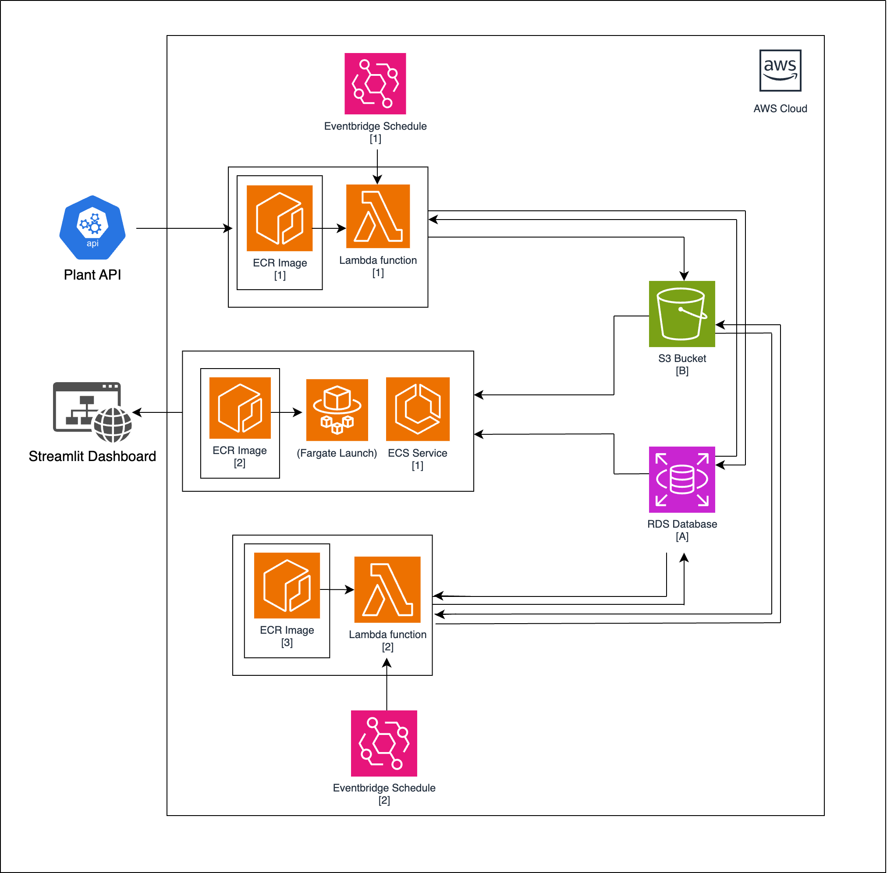

 
# 🪴 Liverpool Natural History Museum Plant Monitoring System

## 🔎 Overview

Welcome to the Liverpool Natural History Museum Plant Monitoring System repository! This project aims to provide a comprehensive solution for monitoring and analyzing the health of plants in the museum's conservatory. The system utilises a network of sensors connected to Raspberry Pi devices, collecting real-time data on various environmental factors affecting plant growth.

## 🗂️ Repository Structure

The repository is organised into several key directories, each containing scripts and configuration files necessary for different parts of the system. Here's a brief overview:

- `db_setup`: This directory contains the scripts needed to set up the initial database and populate it with static data.

- `minute_pipeline`: This directory contains the scripts for the minute pipeline, which retrieves plant data from the API, loads it into the short-term database, and moves old data (from over 24 hours ago) from this database to long-term storage.

- `daily_pipeline`: This directory contains the scripts for the daily pipeline, which organises the long-term storage and updates the duties table in the database.

- `dashboard`: This directory contains the scripts that create the plant analytics dashboard. It shows the plant soil moisture and temperature over time for specific plants.

- `terraform`: This directory contains the Terraform scripts for creating the necessary cloud resources for the pipelines and dashboard.

## ✅ Getting Started

Before running the scripts, you need to set up the environment. Follow the instructions in the `README.md` file in each directory to install necessary dependencies and configure the environment variables.

## 🚀 Running the Pipeline

To start monitoring the plant health, follow these steps:

1. Set up the database by running the scripts in the `db_setup` directory.

2. Run the minute pipeline script located in the `minute_pipeline` directory. This script retrieves plant data from the API, loads it into the short-term database, and moves old data to long-term storage.

3. Schedule the daily pipeline script located in the `daily_pipeline` directory to run daily at midnight. This script organises the long-term storage and updates the duties table in the database.

## 📊 Accessing the Dashboard

After setting up the pipelines, you can access the plant analytics dashboard by running the scripts in the `dashboard` directory. This dashboard displays the plant soil moisture and temperature over time for all and specific plants.

## ☁️ Cloud Resources

All the cloud resources required for the pipelines and dashboard are created using Terraform. The Terraform scripts are located in the `terraform` directory. To create the resources, navigate to this directory and execute the Terraform commands.

## 📐 Architect Diagram

This is the architect diagram for the cloud resources:

### Minute Pipeline:
1. EventBridge schedule [1] running every minute, triggering lambda function [1].
2. Lambda function [1] running ECR image [1].
3. ECR image of dockerised python script downloading data from plant API, cleaning it, and uploading to RDS [A], and retrieving any data from this database [A] older than 24hrs and storing it in S3 bucket [B].

### Daily Pipeline:
1. Eventbridge schedule [2] running every day at 00:15, triggering lambda function.
2. Lamba function [2] running ECR image [3].
3. ECR image of dockerised python script, adds old data to a cumulative csv for the month, making new files/folder if it's the first day of a month/year all in the S3 bucket [B]. Updates the database [A] duties table if plant duties have changed.

### Dashboard:
1. ECS service [1] running Fargate launch of ECR image [2].
2. ECR image of dockerised python script running Streamlit dashboard with data from the short term database [A] and long term storage S3 bucket [B].

## 📞 Support

If you encounter any issues while using this system, please reach out to the team for assistance.

🦋 **Thank you for choosing the Plant Health Monitoring System.**
